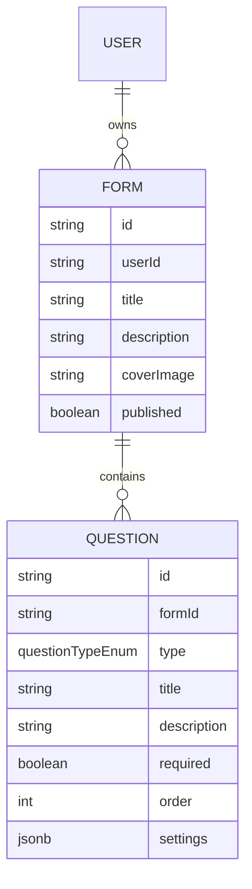

# AI Chat-Driven Form Creation

## Enhancement Summary

**Deepened on:** 2026-03-14
**Research agents used:** best-practices-researcher, framework-docs-researcher, security-sentinel, architecture-strategist, performance-oracle, kieran-typescript-reviewer, code-simplicity-reviewer

### Key Improvements from Research

1. **Simplify to non-streaming for v1** — Skip SSE entirely. Await the full Claude response (2–5s), show a spinner. The Anthropic SDK with `tool_choice: { type: "tool" }` returns structured JSON atomically, not token-by-token text. No streaming benefit for JSON output.
2. **Use a single `generate_form` tool** — One tool call returns the entire form structure vs. multiple incremental tools. Simpler client, simpler server, same result.
3. **Skip image upload for v1** — Base64 images hit Vercel's 4.5MB request body limit with typical photos. No storage infrastructure exists. The cover image URL field already works in the editor.
4. **Skip preview panel for v1** — User lands in FormBuilder immediately after generation. FormBuilder IS the preview/edit UI.
5. **Critical security**: middleware doesn't protect `/api/ai/*` — in-handler auth is mandatory.
6. **Performance**: `serverExternalPackages: ['@anthropic-ai/sdk']` in `next.config.ts` prevents 800KB–1.2MB client bundle leak.
7. **TypeScript**: Use `as const` QUESTION_TYPES array as single source of truth for the union type.

### Scope Cuts for v1 (Deferred)
- SSE streaming → POST + await full response
- Form preview panel in modal → redirect straight to FormBuilder
- Multi-turn conversation → single-shot generation
- Image upload → cover image set manually in editor
- Zod validation of tool_use output → trust schema enforcement
- DashboardActions.tsx separate file → inline in dashboard

---

## Overview

Add an AI-powered form creation mode alongside the existing manual builder. Users open a modal, describe their form in natural language, and Claude generates the complete form structure. They are immediately redirected to the existing FormBuilder to review and edit. The existing manual builder is unchanged.

This plan also resolves current code quality issues (duplicated `QuestionType` union in 3 files, stale metadata, `as any` in actions, un-auth-gated answer endpoints) to deliver a fully functional product.

## Problem Statement / Motivation

Creating forms manually requires upfront knowledge of all fields and clicking through UI for each one. Many users have a clear mental model ("a customer satisfaction survey with NPS and open feedback") but the translation is tedious. AI-assisted creation lowers the bar and lets users start from a complete draft in seconds.

## Current Bugs / Tech Debt to Fix

| Issue | Location | Fix |
|---|---|---|
| `QuestionType` union duplicated in 3 files | `FormBuilder.tsx:36`, `ConversationalForm.tsx:10`, `form-utils.ts:1` | Single `QUESTION_TYPES as const` array in `src/lib/types.ts` |
| Page metadata says "Create Next App" | `src/app/layout.tsx:16` | Update title/description |
| `as any` on `updateQuestion` | `src/app/forms/[id]/edit/actions.ts:74` | Use `typeof questions.$inferInsert` partial |
| Generic `handleUpdateField` forces unsafe casts | `FormBuilder.tsx:146,151` | Replace with typed handlers: `handleUpdateTitle`, `handleUpdateType`, `handleUpdateRequired`, `handleUpdateSettings` |
| `reorderQuestions` fires N individual queries | `src/app/forms/[id]/edit/actions.ts:97` | Batch into single `Promise.all` with N updates (or a CTE) — already uses `Promise.all`, document the known limitation |
| `/f/[id]/actions.ts` has zero auth on answers | `src/app/f/[id]/actions.ts` | Add formId ownership check before answer writes (pre-existing, fix now) |
| `saveAnswer` delete-then-insert is not atomic | `src/app/f/[id]/actions.ts:15` | Use Drizzle `onConflictDoUpdate` |

## Proposed Solution

### User Flow

```
Dashboard
├── [New: Create with AI ✨] button → opens AI chat modal
│   ├── User types description ("I need a job application form...")
│   ├── [Generate] button → POST to /api/ai/generate-form
│   ├── Spinner while awaiting Claude response (2–5s)
│   ├── Success → createFormFromAI server action → DB insert
│   └── Redirect to /forms/[id]/edit (FormBuilder is the review surface)
└── [Existing: Create Form] button → unchanged
```

### Architecture (Simplified)

```
Browser                     Server                    External
──────                      ──────                    ────────
[Modal textarea]
[Generate button] ──POST──> /api/ai/generate-form ──> Anthropic Claude
                   JSON                           <── generate_form tool call
                   { formId } <── createFormFromAI()
                              (Drizzle bulk insert in transaction)
router.push(/forms/[formId]/edit)
```

**No SSE. No streaming. One round trip.**

### Constraints & Guardrails Enforced by Tool Schema

- Only supported question types: `short_text | long_text | multiple_choice | yes_no | rating | likert | email | number | date`
- `multiple_choice` requires options array with 2–6 items
- `rating` validation: `max` of 5 or 10 only
- `likert` options: exactly 5 items (the standard scale labels)
- Max 20 questions per form
- Form title required, max 200 chars

## Technical Approach

### Phase 1: Foundations & Bug Fixes (Do First)

**1a. Shared types — `src/lib/types.ts`**

```typescript
// Single source of truth — eliminates all 4 duplicated definitions
export const QUESTION_TYPES = [
  "short_text", "long_text", "multiple_choice", "yes_no",
  "rating", "likert", "email", "number", "date",
] as const;

export type QuestionType = (typeof QUESTION_TYPES)[number];

// Discriminated settings union — eliminates all the `as string[]` casts
export type MultipleChoiceSettings = { options: string[] };
export type RatingSettings = { max: 5 | 10 };
export type LikertSettings = { labels: [string, string, string, string, string] };

export type QuestionSettings =
  | { type: "multiple_choice"; settings: MultipleChoiceSettings }
  | { type: "rating"; settings: RatingSettings }
  | { type: "likert"; settings: LikertSettings }
  | { type: "short_text" | "long_text" | "yes_no" | "email" | "number" | "date"; settings?: never };
```

Update all import sites: `FormBuilder.tsx`, `ConversationalForm.tsx`, `form-utils.ts`, `actions.ts`.

**Why the `as const` pattern:** `Object.keys(TYPE_LABELS) as QuestionType[]` in `FormBuilder.tsx:280` is an unsafe cast. With `QUESTION_TYPES` as a const array, you can iterate it directly and the union is derived automatically. Adding a new question type requires changing exactly one file.

**1b. Fix `updateQuestion` — `src/app/forms/[id]/edit/actions.ts:74`**

Replace the `as any` cast with proper Drizzle inference:

```typescript
import type { questions } from "@/lib/db/schema";

type UpdateableQuestionFields = Pick<
  typeof questions.$inferInsert,
  "title" | "type" | "required" | "settings"
>;

export async function updateQuestion(
  formId: string,
  questionId: string,
  data: Partial<UpdateableQuestionFields>
) {
  await verifyOwnership(formId);
  await db.update(questions).set(data).where(
    and(eq(questions.id, questionId), eq(questions.formId, formId))
  );
}
```

**1c. Fix `handleUpdateField` in `FormBuilder.tsx`**

Replace the generic key-value setter (which forces `as Parameters<...>[2]` cast) with four explicit handlers:

```typescript
function handleUpdateTitle(title: string) { ... }
function handleUpdateType(type: QuestionType) { ... }
function handleUpdateRequired(required: boolean) { ... }
function handleUpdateSettings(settings: UpdateableQuestionFields["settings"]) { ... }
```

**1d. Fix `saveAnswer` atomicity — `src/app/f/[id]/actions.ts:15`**

Replace delete-then-insert with Drizzle `onConflictDoUpdate`:

```typescript
await db.insert(answers)
  .values({ id: createId(), responseId, questionId, value })
  .onConflictDoUpdate({
    target: [answers.responseId, answers.questionId],
    set: { value },
  });
```

**1e. Metadata — `src/app/layout.tsx:16`**

```typescript
export const metadata: Metadata = {
  title: "Formly",
  description: "Create beautiful forms in seconds",
};
```

### Phase 2: AI Backend

**2a. Install dependencies**

```bash
npm install @anthropic-ai/sdk
npm install server-only
```

Note: Do NOT use `NEXT_PUBLIC_ANTHROPIC_API_KEY` — Next.js statically inlines `NEXT_PUBLIC_` vars into the browser bundle, exposing the key. Use `ANTHROPIC_API_KEY` (no prefix).

**2b. Configure `next.config.ts`**

```typescript
// next.config.ts
const nextConfig: NextConfig = {
  serverExternalPackages: ["@anthropic-ai/sdk"], // CRITICAL: prevents 800KB+ bundle leak
  async headers() {
    return [{
      source: "/(.*)",
      headers: [
        { key: "X-Content-Type-Options", value: "nosniff" },
        { key: "X-Frame-Options", value: "DENY" },
        { key: "Referrer-Policy", value: "strict-origin-when-cross-origin" },
      ],
    }];
  },
};
```

**2c. Anthropic SDK module — `src/lib/anthropic.ts`**

```typescript
import "server-only"; // Build-time error if imported by any Client Component
import Anthropic from "@anthropic-ai/sdk";

if (!process.env.ANTHROPIC_API_KEY) {
  throw new Error("ANTHROPIC_API_KEY is not set");
}

export const anthropic = new Anthropic({
  apiKey: process.env.ANTHROPIC_API_KEY,
});
```

**2d. API Route — `src/app/api/ai/generate-form/route.ts`**

```typescript
import "server-only";
import { auth } from "@/auth";
import { anthropic } from "@/lib/anthropic";
import { NextRequest, NextResponse } from "next/server";

// System prompt (inline — only used here)
const SYSTEM_PROMPT = `You are a form creation assistant for a Typeform-style app.
Call the generate_form tool with a complete form definition based on the user's description.
Rules:
- Generate 3–15 questions unless specified otherwise
- For multiple_choice: always provide 2–6 meaningful options
- For likert: options must be exactly: ["Strongly Disagree","Disagree","Neutral","Agree","Strongly Agree"]
- For rating: settings.max must be 5 or 10
- Make question titles conversational and friendly
- Set required: true only for genuinely essential fields (name, email on contact forms)
- Never return plain text — always call generate_form`;

// Tool definition (inline — only used here)
const GENERATE_FORM_TOOL: Anthropic.Tool = {
  name: "generate_form",
  description: "Generate a complete form based on the user's description",
  input_schema: {
    type: "object" as const,
    required: ["title", "questions"],
    properties: {
      title: { type: "string", description: "Form title, max 200 chars" },
      description: { type: "string", description: "Optional form subtitle" },
      questions: {
        type: "array",
        minItems: 1,
        maxItems: 20,
        items: {
          type: "object",
          required: ["type", "title"],
          properties: {
            type: {
              type: "string",
              enum: ["short_text","long_text","multiple_choice","yes_no","rating","likert","email","number","date"],
            },
            title: { type: "string" },
            description: { type: "string" },
            required: { type: "boolean", default: false },
            settings: {
              type: "object",
              properties: {
                options: { type: "array", items: { type: "string" }, maxItems: 6 },
                max: { type: "number", enum: [5, 10] },
              },
            },
          },
        },
      },
    },
  },
};

export const maxDuration = 60; // Vercel Pro: allow up to 60s (Claude can take 15-30s)

export async function POST(req: NextRequest) {
  // Auth FIRST — middleware doesn't cover /api/ai/* routes
  const session = await auth();
  if (!session?.user?.id) {
    return NextResponse.json({ error: "Unauthorized" }, { status: 401 });
  }

  let prompt: string;
  try {
    const body = await req.json();
    prompt = typeof body.prompt === "string" ? body.prompt.trim() : "";
  } catch {
    return NextResponse.json({ error: "Invalid JSON" }, { status: 400 });
  }

  if (!prompt || prompt.length < 5 || prompt.length > 2000) {
    return NextResponse.json({ error: "Prompt must be 5–2000 characters" }, { status: 400 });
  }

  // Simple in-memory rate limit (upgrade to Upstash Redis for production)
  // 10 generations per user per hour
  // (implementation omitted for brevity — add before launch)

  try {
    const message = await anthropic.messages.create({
      model: "claude-sonnet-4-6",
      max_tokens: 2048,
      system: SYSTEM_PROMPT,
      tools: [GENERATE_FORM_TOOL],
      tool_choice: { type: "tool", name: "generate_form" }, // forces structured output
      messages: [{ role: "user", content: prompt }],
    });

    // Find the tool_use content block
    const toolUse = message.content.find((b) => b.type === "tool_use");
    if (!toolUse || toolUse.type !== "tool_use") {
      return NextResponse.json({ error: "AI did not generate a form" }, { status: 500 });
    }

    return NextResponse.json({ form: toolUse.input });
  } catch (err) {
    if (err instanceof Error && err.message.includes("anthropic")) {
      return NextResponse.json({ error: "AI service error" }, { status: 502 });
    }
    return NextResponse.json({ error: "Generation failed" }, { status: 500 });
  }
}
```

**Why `tool_choice: { type: "tool" }` not streaming:**
- Forces Claude to return structured JSON — no text responses, no hallucinated structure
- The entire response arrives atomically (no need to buffer `input_json_delta` chunks)
- `stop_reason` will be `"tool_use"` not `"end_turn"` — the SDK handles this transparently when not streaming
- 2–5s wait with a spinner is fine UX for form generation

**2e. `createFormFromAI` server action — `src/app/dashboard/actions.ts` (new export)**

```typescript
export async function createFormFromAI(formData: {
  title: string;
  description?: string;
  questions: Array<{
    type: string;
    title: string;
    description?: string;
    required?: boolean;
    settings?: Record<string, unknown>;
  }>;
}): Promise<{ formId: string }> {
  const session = await auth();
  if (!session?.user?.id) throw new Error("Unauthorized");

  // userId always from session — never from client payload
  const formId = await db.transaction(async (tx) => {
    const [form] = await tx
      .insert(forms)
      .values({
        id: createId(),
        userId: session.user.id,
        title: formData.title.slice(0, 200),
        description: formData.description?.slice(0, 500),
        published: false,
      })
      .returning({ id: forms.id });

    if (formData.questions.length > 0) {
      await tx.insert(questions).values(
        formData.questions.slice(0, 20).map((q, i) => ({
          id: createId(),
          formId: form.id,
          type: q.type as QuestionType, // validated by tool schema before this point
          title: q.title.slice(0, 500),
          description: q.description?.slice(0, 1000),
          required: q.required ?? false,
          order: i,
          settings: q.settings ?? null,
        }))
      );
    }

    return form.id;
  });

  return { formId };
}
```

**Why `db.transaction()`:** Without a transaction, a crash between `forms` insert and `questions` insert leaves an empty orphaned form in the DB. The transaction makes it all-or-nothing. This is the correct pattern — the original plan had two separate inserts.

### Phase 3: Modal UI

**3a. Modal — `src/app/dashboard/CreateWithAIModal.tsx`**

Target: ~80 lines. No preview panel, no streaming display, no multi-turn.

```typescript
"use client";

import { useState } from "react";
import { useRouter } from "next/navigation";
import { createFormFromAI } from "./actions";

interface Props { onClose: () => void }

export function CreateWithAIModal({ onClose }: Props) {
  const [prompt, setPrompt] = useState("");
  const [status, setStatus] = useState<"idle" | "generating" | "error">("idle");
  const [error, setError] = useState<string | null>(null);
  const router = useRouter();

  async function handleGenerate() {
    if (!prompt.trim() || status === "generating") return;
    setStatus("generating");
    setError(null);

    try {
      const res = await fetch("/api/ai/generate-form", {
        method: "POST",
        headers: { "Content-Type": "application/json" },
        body: JSON.stringify({ prompt }),
      });

      if (!res.ok) {
        const { error } = await res.json();
        throw new Error(error ?? "Generation failed");
      }

      const { form } = await res.json();
      const { formId } = await createFormFromAI(form);
      router.push(`/forms/${formId}/edit`);
    } catch (err) {
      setError(err instanceof Error ? err.message : "Something went wrong");
      setStatus("error");
    }
  }

  return (
    // Modal overlay + dialog — use shadcn Dialog or native <dialog>
    // Layout: centered modal, ~500px wide
    // Textarea for prompt
    // Generate button (disabled + spinner while generating)
    // Error display
    // Cancel / close button
  );
}
```

**Modal design notes:**
- Use shadcn `Dialog` (Radix UI) — handles focus trap, Escape key, scroll lock, `::backdrop`, aria-modal automatically. If not installed, native `<dialog ref={ref}>.showModal()` in React 19 is the zero-dependency alternative.
- No `useReducer` needed for this simplified state — 3 `useState` hooks is fine.
- Keyboard: Escape closes (handled by dialog), Enter in textarea should NOT submit (multi-line input).

**3b. Dashboard integration — `src/app/dashboard/page.tsx`**

The page is a server component. Extract the interactive header into a thin client component:

```typescript
// src/app/dashboard/DashboardHeader.tsx
"use client";

import { useState } from "react";
import { createForm } from "./actions";
import { CreateWithAIModal } from "./CreateWithAIModal";

export function DashboardHeader() {
  const [showAI, setShowAI] = useState(false);
  return (
    <>
      <div className="flex gap-2">
        <button onClick={() => setShowAI(true)}>Create with AI ✨</button>
        <form action={createForm}><button type="submit">+ New Form</button></form>
      </div>
      {showAI && <CreateWithAIModal onClose={() => setShowAI(false)} />}
    </>
  );
}
```

`page.tsx` remains a server component — renders `<DashboardHeader />` at the top, passes form data to the grid below. No conversion of the page to a client component needed.

## System-Wide Impact

### Interaction Graph
```
User submit → fetch POST /api/ai/generate-form
  → auth() check (session)
  → anthropic.messages.create() (2–5s, blocking)
  → tool_use block extracted
  → createFormFromAI server action
    → db.transaction: insert form + all questions
  → router.push(/forms/[id]/edit)
  → FormBuilder loads (existing server component)
```

### Error Propagation
- Auth failure → `401` JSON → modal shows "Please log in" error
- Anthropic API error → `502` JSON → modal shows retry-able error
- Invalid prompt → `400` JSON → modal shows validation message
- DB insert failure → transaction rolled back → no orphaned form → modal shows error

### State Lifecycle Risks
- No partial state: transaction means form + questions are atomic
- If user navigates away during the 2–5s fetch: fetch completes, DB insert succeeds, but redirect never fires. Form exists but user doesn't know. Acceptable for v1 — add cleanup job later.

### API Surface Parity
- AI-generated forms are structurally identical to manually-created forms (same DB schema)
- The `settings` JSONB shape from AI matches exactly what `QuestionInput` expects in `ConversationalForm.tsx`
- `verifyOwnership` pattern from edit actions is replicated in `createFormFromAI`

### Pre-existing Security Issue (Fix Now)
`/src/app/f/[id]/actions.ts` — `saveAnswer` and `completeResponse` have zero auth checks. Any caller can write to any response. At minimum, verify the `formId` from the `responseId` row is a published form before writing. This is unrelated to AI but must be fixed before launch.

## Acceptance Criteria

### Functional
- [ ] "Create with AI ✨" button visible on dashboard
- [ ] Modal opens with textarea and Generate button
- [ ] User can describe form in natural language, click Generate
- [ ] Spinner shown while waiting for Claude (~2–5s)
- [ ] On success: redirected to `/forms/[id]/edit` with all questions pre-populated
- [ ] On error: descriptive message shown, user can retry
- [ ] All 9 question types generatable by AI with correct settings
- [ ] Existing "Create Form" flow unchanged

### Non-Functional
- [ ] `ANTHROPIC_API_KEY` in `.env.local`, never `NEXT_PUBLIC_`
- [ ] `serverExternalPackages: ['@anthropic-ai/sdk']` in `next.config.ts`
- [ ] Auth check is the first operation in the API route handler
- [ ] All questions inserted in a single Drizzle transaction
- [ ] `import 'server-only'` in `src/lib/anthropic.ts`
- [ ] Zero TypeScript errors after all changes

### Bug Fixes
- [ ] `QuestionType` defined once (`QUESTION_TYPES as const` in `src/lib/types.ts`)
- [ ] `updateQuestion` uses `typeof questions.$inferInsert`, no `as any`
- [ ] `handleUpdateField` replaced with typed handler functions
- [ ] `saveAnswer` uses `onConflictDoUpdate` (atomic)
- [ ] App metadata updated
- [ ] `/f/[id]/actions.ts` answer writes verify form ownership

## Dependencies & Risks

| Dependency | Risk | Mitigation |
|---|---|---|
| `@anthropic-ai/sdk` | API key required, cost per call | Document in `.env.local.example`; add `max_tokens: 2048` cap |
| Vercel function timeout | Default 10s, Claude can take 15–30s | `export const maxDuration = 60` (requires Vercel Pro) |
| No rate limiting | Authenticated abuse burns API credits | Add simple in-memory limiter before launch; Upstash Redis for production |
| Anthropic API downtime | Modal shows error | Graceful error message with retry; manual form creation still works |

## File Change Summary

### New Files
- `src/lib/types.ts` — `QUESTION_TYPES`, `QuestionType`, `QuestionSettings` discriminated union
- `src/lib/anthropic.ts` — SDK singleton with `server-only` guard
- `src/app/api/ai/generate-form/route.ts` — POST handler (non-streaming)
- `src/app/dashboard/CreateWithAIModal.tsx` — modal UI (~80 lines)
- `src/app/dashboard/DashboardHeader.tsx` — thin client wrapper for dashboard header buttons
- `.env.local.example` — document `ANTHROPIC_API_KEY=`

### Modified Files
- `next.config.ts` — add `serverExternalPackages`, security headers
- `src/app/layout.tsx` — fix metadata title/description
- `src/lib/types.ts` ← (new, replaces local type definitions in 3 files below)
- `src/app/forms/[id]/edit/FormBuilder.tsx` — import `QuestionType` from shared types, replace `handleUpdateField` with typed handlers
- `src/app/f/[id]/ConversationalForm.tsx` — import `QuestionType` from shared types
- `src/lib/form-utils.ts` — import `QuestionType` from shared types
- `src/app/forms/[id]/edit/actions.ts` — fix `updateQuestion` (no `as any`), use `typeof questions.$inferInsert`
- `src/app/dashboard/actions.ts` — add `createFormFromAI` action
- `src/app/dashboard/page.tsx` — render `<DashboardHeader />` in place of inline buttons
- `src/app/f/[id]/actions.ts` — fix `saveAnswer` atomicity, add ownership check

## ERD (No Schema Changes Required)



AI-generated forms use the identical DB structure. No migration required.

## Performance Checklist

From performance research:

- [ ] `serverExternalPackages: ['@anthropic-ai/sdk']` in `next.config.ts` — prevents 800KB+ client bundle leak
- [ ] `import 'server-only'` in `src/lib/anthropic.ts` — compile-time enforcement
- [ ] `max_tokens: 2048` on every Anthropic call — hard cost cap
- [ ] `export const maxDuration = 60` on the route handler — Vercel Pro timeout
- [ ] Bulk insert: `db.insert(questions).values([...])` — one DB round trip, not N
- [ ] Wrap bulk insert in `db.transaction()` — atomicity

## Security Checklist

From security research:

- [ ] `session = await auth()` is the FIRST line in the POST handler (before any Anthropic call)
- [ ] Return `401` JSON (not redirect) for unauthenticated API requests
- [ ] `userId` in `createFormFromAI` comes from `session.user.id`, never from client payload
- [ ] Prompt validated: `typeof prompt === "string" && prompt.length >= 5 && prompt.length <= 2000`
- [ ] `tool_choice: { type: "tool", name: "generate_form" }` — forces structured output, mitigates prompt injection
- [ ] `ANTHROPIC_API_KEY` never prefixed with `NEXT_PUBLIC_`
- [ ] Rate limiting added before launch (10 generations/user/hour minimum)
- [ ] `/f/[id]/actions.ts` answer writes verified against form ownership

## Success Metrics

- User can describe a form and receive a complete draft in under 10s end-to-end
- AI correctly maps natural language to all 9 question types
- Zero regressions on existing manual builder flow
- All TypeScript strict-mode checks pass
- No `any` casts in codebase after completion

## Sources & References

### Internal References
- Form builder: `src/app/forms/[id]/edit/FormBuilder.tsx`
- Dashboard actions: `src/app/dashboard/actions.ts`
- Form schema: `src/lib/db/schema.ts:69–130`
- QuestionInput renderer: `src/app/f/[id]/ConversationalForm.tsx:232`
- Existing metadata: `src/app/layout.tsx:16`

### External References
- Anthropic tool use: https://docs.anthropic.com/en/docs/build-with-claude/tool-use
- Next.js Route Handlers: https://nextjs.org/docs/app/building-your-application/routing/route-handlers
- Drizzle transactions: https://orm.drizzle.team/docs/transactions
- Vercel function duration: https://vercel.com/docs/functions/configuring-functions/duration
- Upstash rate limiting: https://upstash.com/docs/redis/sdks/ratelimit-ts/overview

### Research Insights Applied
- **Anthropic SDK**: buffer all `input_json_delta` events before parsing — BUT with non-streaming `messages.create()`, the SDK handles this internally. No manual buffering needed.
- **React 19**: native `<dialog>.showModal()` handles focus trap + Escape + backdrop natively — prefer over hand-rolled modal
- **Vercel AI SDK**: considered but raw `@anthropic-ai/sdk` is sufficient for single-shot (non-streaming) tool use — avoids extra dependency
- **Security**: `tool_choice: { type: "tool" }` is the primary prompt injection mitigation — forces structured output regardless of user prompt content
- **Architecture**: DashboardClient wrapper pattern preserves server component for data fetching while enabling modal state in the header
